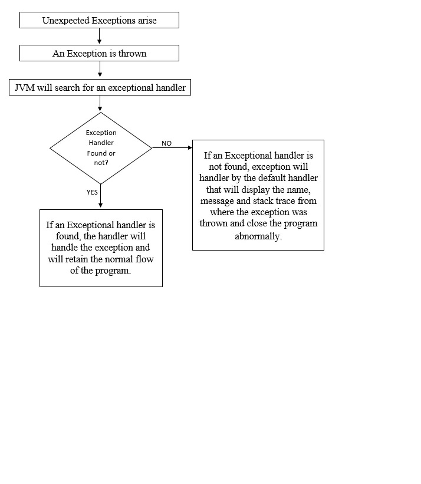

# Exception Handling in Java

Understanding Exceptions in Java

An exception is an unexpected event, that usually arises during the execution of the program. This leads to the
disruption to the normal flow of the program and then the program stops abnormally.

### What is Exception Handling?

An Exception Handling is a technique which helps to retain the normal flow of the program, even if the unexpected
problems arise in the code during the execution. Commonly, the problems arise such as wrong input data formats, network
Connection Failure, opening a non-existing file and more.

**Steps followed to handle an Exception**



### Exception Hierarchy


There are two types of exceptions:

Checked

Unchecked

Errors and runtime exceptions are collectively known as Unchecked exceptions.

**Checked Exceptions**: An exception that is handled or checked by the compiler at compilation time only. Example are
IOException, SQLException, Interrupted Exception, FileNotFoundException, etc.

**Runtime Exceptions**: An exception that is handled or checked at the time of execution or runtime only. Example are
ArithmeticException, NumberFormat Exception, ArrayIndexOutOfBoundsException, SecurityException, etc.

**Error**: Errors are irreversible. It always happens at runtime. It is caused by the environment in which the
application is running. Example are OutOfMemoryError, AssertionError, etc.

**Basic Exception Handling Program**

```
Class Exception{
    public static void main(String args[]){
        try{
            //CODE THAT MAY RAISE AN EXCEPTION
        }
        catch(Exception e){
            //REST OF THE PROGRAM
            //THAT WILL RUN IF AN EXCEPTION ARISE
        }
    }
}
```

### Built-in Exceptions

These are the exceptions which are already present in the Java Libraries. These can be helpful to handle certain error
situations.

List of some Built-in exceptions are:

**ArithmeticException**

It is thrown when an exception occurred due to some arithmetic operations.

```
class HelloWorld {
    public static void main(String[] args) {
        int a = 9;
        int b = 0;
        try{
            int sum = a / b;
            System.out.print("Result is ="+sum);
        }
        catch(ArithmeticException e){
            System.out.print("Number cannot be divided by zero");
        }
    }
}
```

**ArrayIndexOutOfBoundException**

```
class HelloWorld {
    public static void main(String[] args) {
        int[] a = new int[5];
        try{
            a[6] = 7;
        }
        catch(ArrayIndexOutOfBoundsException e){
            System.out.print("Array index out of limits");
        }
    }
}
```

**NumberFormatException**

```
class HelloWorld{
    public static void main(String args[]){
        try{
            int num = Integer.parseInt("9A");
            System.out.println(num);
        }
        catch(NumberFormatException e){
            System.out.println("INVALID NUMBER FORMAT");
        }
    }
}
```

**StringIndexOutOfBoundsException**

```
class HelloWorld{
    public static void main(String args[]){
        try{
            String word = "My Name is Prithvi";
            System.out.println(word.charAt(19));
        }
        catch(StringIndexOutOfBoundsException e){
            System.out.println("String Index Out of limits");
        }
    }
}
```

and many more…

### User Defined Exceptions

User Defined Exceptions are the exceptions which are not present in the java exception library. We programmers used to
create and use our own designed exceptions in order to enhance the error statements for better understanding.

Java provides us the facility to develop our own exceptions and throw exception using throw keywords.

Example:

```
class HelloWorld{
    public static void main(String args[]){
        try{
            int a = 9;
            int b = 0;
            int c = 10;
            //int e = a / b;
            int f = a / c;
            System.out.println("Result is:" + f);
            if(f == 0){
                throw new MyException("My Designed Exception");
            }
        }
        catch(ArithmeticException e){
            System.out.println("ERROR IN DIVIDING");
        }
        catch(MyException e1){
            System.out.println(e1.getMessage());
        }
    }
}
class MyException extends Exception{
    public MyException(String message){
        super(message);
    }
}
```

**Exception Handling Keywords**
Java Exception handling is mainly managed by five keywords:
Try, Catch, Throw, Throws, Finally

Keywords used in Java Exception Handling
Now I will elaborate the keywords below.

**Try**

This block is used to specify a block where we should place the exception code.

Syntax:

try{//Code that throws an exception}

Nested Try: one or more try blocks inside a try block.

```
class HelloWorld {
public static void main(String[] args) {

        try{
            try{
                int num = Integer.parseInt("9");
                System.out.println(num);
            }
            catch(NumberFormatException e){
                System.out.println("INVALID NUMBER FORMAT");
            }
            try{
                int[] a = new int[5];
                a[0] = 9;
                System.out.println(a[0]);
            }
            catch(ArrayIndexOutOfBoundsException e){
                System.out.println("Array ondex out of limits");
            }
            int a = 0; int b = 2; int c = b/a;
            System.out.println("Sum =" + c);
        System.out.println("Print some other statements");
        }
        catch(Exception e){
            System.out.println("Handled and Recovered");
        }
    }
}
```

**Catch**

This block is used to handle the exception.

Syntax:

catch(Exception e){// handling of exception}

Multi Catch: One or more catch blocks in one program.

```
class HelloWorld {
    public static void main(String[] args) {
        try{
            int num = Integer.parseInt("9A");
            System.out.println(num);
        }
        catch(NumberFormatException e){
            System.out.println("INVALID NUMBER FORMAT");
        }
        catch(ArrayIndexOutOfBoundsException e){
            System.out.println("Array ondex out of limits");
        }
        catch(ArithmeticException e){
            System.out.println("Cant divide number by zero");
        }
    }
}
```

**Finally**

This Block is used to specify the important code, which we want to run anyway. Even if an exception arise and not
handled using catch block, finally block statements will run, certainly. This block usually include code for closing
connections or streams, etc.

```
class HelloWorld {
    public static void main(String[] args) {
        try{
            int num = Integer.parseInt("9A");
            System.out.println(num);
        }
        finally{
            System.out.println("I WILL RUN EVEN IF PROGRAM IS NOT RUNNING");
        }
    }
}
```

**Throw**

This is a keyword used to throw an exception.

```
class HelloWorld{
    static void print(){
        try{
            throw new StringIndexOutOfBoundsException("TESTING");
        }
        catch(StringIndexOutOfBoundsException e){
            System.out.println("String Index Out of limits, hence worked");
        }
    }
    public static void main(String args[]){
        print();
    }
}
```

**Throws**

This is a keyword used to declare exceptions. It does not throw any exception, but tells that there can be any exception
in a method. Always used with the method signature. It gives an information to the programmers that there can be
exception.

```
class HelloWorld{
    static void print() throws NumberFormatException{
        System.out.print("Function1");
        throw new NumberFormatException("HELLO FUNCTION 1");
    }
    public static void main(String args[]){
        try{
            print();
        }
        finally{
            System.out.print("GOT THE EXCEPTION");
        }
    }
}
```

**try with resources**
Basically try with resources is used to remove the complexity of having an extra finally block to close the files or
streams. It is assured by JVM that the resources will be closed once try block execution is done.

Format of a try catch finally :

```
public class DemoException {

    public static void main(String args[]) {
        method();
    }
    static void method() {
        try{ 
            // open a file
            // open a file stream
        } catch(Exception e) {
            
        } finally {
            //close the file and the file stream
        }
        
    }
}
```

If we had to do the same thing using try with resources, then we will not use finally because once the try block is done
executing, by default JVM will close the streams and files which were used by try.

Format of try with resources:

```
public class DemoException {

    public static void main(String args[]) {
        method();
    }
    static void method() {
        try(){
            // business logic
        } catch(Exception e) {

        } 

    }
}
```

**try**(<write the code to open any resources like files and streams>)

An example of try with resources :

```
import java.io.File;
import java.io.FileOutputStream;
import java.io.IOException;
import java.io.OutputStream;
import java.util.logging.Level;
import java.util.logging.Logger;

public class DemoException {

    static DemoException demoException;

    private static final Logger LOGGER =  Logger.
                 getLogger(Logger.GLOBAL_LOGGER_NAME);
    public static void main(String args[]) throws IOException {
        demoException = new DemoException();
        demoException.fileOperations();
    }
    void fileOperations() {
        try {
            File file = demoException.createFile();
            demoException.openOutputStream(file);
        } catch (Exception e) {
            LOGGER.log(Level.WARNING, "Error in file");
        }
    }
    File createFile() {
        File myFile = null;
        try {
            myFile = new File("newFile.txt");
            System.out.println(myFile.getAbsolutePath());
            if (myFile.createNewFile()) {
                System.out.println("File is created!");
            } else {
                System.out.println("File already exists.");
            }
        } catch(Exception e) {
            LOGGER.log(Level.WARNING, "Error in creating file");
        }
        return myFile;
    }
    void openOutputStream(File file) throws IOException {
        try (OutputStream out = new FileOutputStream(file)) {
            write(out);
            System.out.println("Output Stream");
        }
    }
    void write(OutputStream out) throws IOException {
        throw new IOException();
    }
}
```

Outputs an exception. write() throws an exception. The exception is then catched by openOutputStream(). openOutputStream
although doesn't have a catch block, throws an exception to fileOperations(), which is catched and then on console we
see an exception logged.
Outputs : WARNING: Error in file
If you see the above code, try with resources does not have a catch block, it internally takes care of catching the
exception and throwing the exception to the caller of the method.

**Exception handling with for loops**:
What will be printed on console if you run the below code ?

```
public class DemoException {
    public static void main(String args[]) {
        for(int i = 0; i<10;i++) {
            try {
                throw new RuntimeException();
            } catch (Exception e) {
                System.out.println("Error thrown" +e);
            }
        }
    }
}
```

The options are :

Prints the exception just once
Prints the exception 10 times

The answer is — It will print the exception 10 times, because we are handling all the exceptions inside for loop.

However, if we specifically throw an exception inside the catch block, then the Error thrown statement marked in Bold
will be printed just once.

```
public class DemoException {
    public static void main(String args[]) {
        for(int i = 0; i<10;i++) {
            try {
                throw new RuntimeException();
            } catch (Exception e) {
                System.out.println("Error thrown" +e);
                throw new RuntimeException();
            }
        }
    }
}
```

Now, if we have try catch block outside the for loop, then also “Error thrown” is printed just once.

```
public class DemoException {
    public static void main(String args[]) {
        try {
            for (int i = 0; i < 10; i++) {
                throw new RuntimeException();
            }
        } catch (Exception e) {
            System.out.println("Exception thrown" +e);
        }
    }
}
```

### Exception Propagation

Exception propagation is a concept of transferring the exception from one method to its previous method in order to
handle the exception.

Let’s see an example and understand better-

```
M1() {
      M2();
}
M2() {
     //Exception raised
}
```

In this example, we have taken two methods, m1() and m2(). We have called m2() method in m1() and have raised an
exception in m2() method. But we have just raised and exception, but not handled it. So it propagates the exception to
the previous method or caller method and now the caller method that is m1() method is responsible for the handling of
the exception.

### Re throwing Exception

When an exception is raised, firstly the exception is caught by the catch block and then the exception is re thrown
using the throw keyword.

See the example for better understanding.

```
Try {
     System.out.println(90/0)
}
Catch(ArithmeticException e) {
     Throw new NullPointerException();
}
```

In this, we can clearly see that there will be error in the print statement. The exception raise will be
ArithmeticException, and we have handled that using catch block. But we have re thrown the exception and converted the
ArithmeticException into other Exception that is NullPointerException.

Converting one exception into other exception type is done with the help of re throwing an exception.

To summarise some differences:

**Error vs Exception**


**Throw vs Throws**


_References:_
https://docs.oracle.com/javase/tutorial/essential/exceptions/
https://medium.com/javarevisited/exception-handling-in-java-503cab4d4742
https://medium.com/linkit-intecs/exception-handling-in-java-b2e6e1b8b6fb