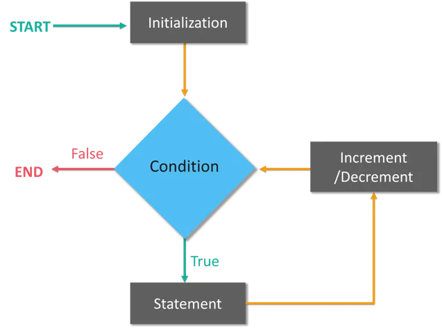

# Loops
The main idea of loops is to repeat our code.
Types of loops :
+ for loop
+ while loops
+ do while loop
+ for each loop

### For Loop
for loop is a good fit when we know an exact number of times we need to iterate.

```dtd

for (init action, boolean expression, update action) {
        body of loop
}


for (int i = 0; i < 10; i++){
   System.out.println("Hello, World!");
}

for (char ch = 'a'; ch <= 'z'; ch++) {
    System.out.println(ch);
}

for (int i = 1; i <= 100; i++) {
    if (i == 77) {
    break;
    }
    System.out.println("Number: " + i);
}

for (int i = 1; i <= 100; i++) {
    if (i == 7 || i == 77 || i == 97) {
    continue;
    }
    System.out.println("Number: " + i);
}
```



#### Nested For Loop 
If you have a for loop inside a for loop, you have encountered a Java nested for loop. The inner loop executes completely when the outer loop executes.
I am presenting an example to show you the working of a Java nested for loop.

```dtd
public class Example{
    public static void main(String[] args) {
        for(int i=1;i<=3;i++){
            for(int j=1;j<=3;j++){
                System.out.println(i+" "+j);
            }
        }
    }
}
```


### While Loop
The while loop loops through a block of code as long as a specified condition is true. Syntax:

```dtd
while (condition) {
  // code block to be executed
}

int i = 0;
while (i < 5) {
    System.out.println(i);
    i++;
}
```

### Do/While Loop

The do/while loop is a variant of the while loop. This loop will execute the code block once, before checking if the condition is true, then it will repeat the loop as long as the condition is true. 
Syntax:
```dtd
do {
  // code block to be executed
}
while (condition);

int i = 0;
do {
    System.out.println(i);
    i++;
}
while (i < 5);
```

### For-each loops

We use For-each loops to iterate over arrays or collections.

```dtd
public class ForEachLoop {

    public static void main(String[] args) {
        String [] names = {"Niluka", "Sripali", "Monnankulama"};
        for(String name : names)
            System.out.println(name);
    }
}
```

Limitations :

+ We can not repeat this array from end to beginning because it is always only forward.
+ For each loop, here we do not have access to the index of each item, we only have this loop variable, which retains the value of each item in the array.